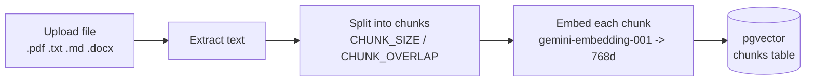
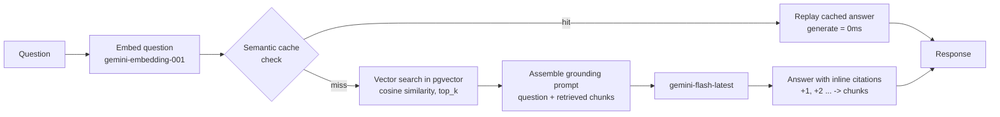

# RAG demo

A small, complete Retrieval-Augmented Generation system: upload documents, ask
questions about them, get answers with citations back to the exact chunks the
answer came from. Built to be read end to end, not just run.

Stack: FastAPI + `uv` (Python 3.12) backend, React + Vite frontend, Postgres
with `pgvector` for storage and vector search, Gemini for embeddings and chat.
Only Postgres runs in Docker — backend and frontend run natively so you can
read logs and edit code while it's running.

See [`CONTRACT.md`](./CONTRACT.md) for the exact API shapes referenced below.

---

## 1. What problem RAG solves

An LLM only knows what was in its training data, plus whatever you put in its
prompt. It doesn't know the contents of *your* PDF, your company's leave
policy, or a document you wrote yesterday. Retraining or fine-tuning a model
on your documents is slow, expensive, and has to be redone every time the
documents change.

RAG sidesteps this: at question time, you search your own document store for
the passages most relevant to the question, and paste those passages into the
prompt alongside the question. The model then answers using text it can
literally see, and you can point at which passage each part of the answer
came from. It's closer to giving the model an open-book exam with the right
page bookmarked than to teaching it something new. The tradeoff is that
answer quality now depends heavily on retrieval quality — if the wrong
passages get pulled in, the model will confidently answer from the wrong
material, which is why most of this codebase is about retrieval, not about
the LLM call itself.

## 2. The two flows

### Ingest: turning a file into searchable vectors



`POST /api/documents` does all of this synchronously and returns once the
document's `status` is `ready` (or `failed`, with an `error`), along with
`n_chunks` and `n_chars` — see `CONTRACT.md`.

### Query: turning a question into a cited answer



The cache check reuses the *same* question embedding that retrieval needs
anyway, so checking the cache costs no extra embedding call. `POST
/api/chat/stream` emits this same sequence as SSE events in a fixed order —
`cache` → `retrieval` → `token`* → `done` — so the UI can show the cache
verdict and citation cards before any text streams in, even on a cache hit
(the cached answer is replayed as `token` events so the typing animation
looks the same either way).

## 3. Quickstart

```bash
# 1. Get a free Gemini API key
#    https://aistudio.google.com/apikey

# 2. Configure
cp .env.example .env
# edit .env and paste your key into GEMINI_API_KEY

# 3. Start Postgres (pgvector) in Docker, wait for it to be healthy
make up

# 4. Install backend (uv) and frontend (npm) dependencies
make install

# 5. In one terminal: run the backend
make backend      # http://localhost:8000

# 6. In another terminal: run the frontend
make frontend     # http://localhost:5173, proxies /api/* -> :8000
```

Open `http://localhost:5173`, upload `samples/acme-employee-handbook.md`, and
ask it questions from `samples/QUESTIONS.md`.

Postgres listens on host port **5433**, not 5432 — see Troubleshooting below
for why.

## 4. The five ideas that make RAG work

Every tunable mentioned below (`CHUNK_SIZE`, `TOP_K`, `MIN_SIMILARITY`,
`EMBED_DIM`, `SEMANTIC_CACHE_THRESHOLD`, ...) is a field on `Settings` in
`backend/app/config.py`, loaded from the repo-root `.env`. The pipeline that
wires all five ideas together is `backend/app/rag.py` — read it top to bottom
if you want the whole story in one file; `ingest()` covers the first idea,
`prepare()`/`retrieve()`/`build_prompt()` cover the rest.

**Chunking and overlap.** A whole document is too big and too unfocused to
embed as one vector, and too big to paste into a prompt. So it gets split
into overlapping windows — `CHUNK_SIZE=1200` characters with
`CHUNK_OVERLAP=200` here (see `.env.example` and `chunk_text()` in
`backend/app/chunking.py`). The overlap exists because a fact can straddle a
chunk boundary; without overlap, a sentence that starts at the end of chunk 3
and finishes at the start of chunk 4 might not fully match either chunk's
embedding. Chunk size is a tradeoff: smaller chunks retrieve more precisely
but lose surrounding context; larger chunks keep context but dilute the
embedding with less relevant text.

**Embeddings as meaning-coordinates.** An embedding model (`gemini-embedding-001`
here, see `embed_documents()` / `embed_query()` in `backend/app/gemini.py`)
turns text into a vector — a list of numbers — such that pieces of text with
similar *meaning* end up as nearby points in that vector space, regardless of
exact wording. "Notice period" and "how much notice do I need to give" land
close together even though they share almost no words. Chunks are embedded
with `task_type=RETRIEVAL_DOCUMENT` and questions with
`task_type=RETRIEVAL_QUERY` — Gemini places the two in the same space only
when each side uses its matching task type, so `gemini.py` keeps them as
separate constants (`TASK_DOCUMENT` / `TASK_QUERY`) rather than one shared
call. This repo truncates Gemini's native 3072-dimensional embedding down to
768 dimensions (`EMBED_DIM`, a "Matryoshka" embedding designed to stay
meaningful when truncated) because pgvector's HNSW index tops out around 2000
dimensions. Google does not normalize truncated vectors, so `l2_normalize()`
in `gemini.py` normalizes them itself before they're stored or compared —
both the document path and the query path funnel through this one helper.

**Cosine similarity.** Once text is a point in vector space, "how related are
these two pieces of text" becomes "how close are these two points" — measured
here as cosine similarity between normalized vectors, computed by pgvector's
`<=>` (cosine distance) operator over an HNSW index built in `sql/schema.sql`
(`chunks_embedding_hnsw`, `vector_cosine_ops`). The actual query lives in
`retrieve()` in `backend/app/rag.py`: a question's embedding is compared
against every stored chunk's embedding via `1 - (embedding <=> q)`, and the
top `TOP_K` chunks by similarity are kept, provided they clear
`MIN_SIMILARITY` — if nothing does, `retrieve()` returns an empty list and
the pipeline returns no citations rather than a guess.

**The grounding prompt.** Retrieval alone doesn't answer anything — the
retrieved chunks still have to be handed to the model with instructions that
constrain it to use them. `build_prompt()` in `backend/app/rag.py`
concatenates the question with the retrieved chunks (each tagged `[n]`, `n`
matching `citations[].n`), and the `SYSTEM_INSTRUCTION` constant in the same
file instructs the model to answer only from that text, cite which block
backed each claim, and say plainly when the provided blocks don't answer the
question. This instruction is what keeps a well-built RAG system from
hallucinating an answer when retrieval comes up empty or off-topic — the
retrieval step can still fail, but the prompt should not paper over that
failure with a confident-sounding guess. When retrieval comes up empty,
`rag.py` doesn't even build a prompt: it short-circuits to a fixed
`NO_CONTEXT_ANSWER` and skips the LLM call entirely.

**Citations.** Every claim in the answer should be traceable to a specific
chunk. `retrieve()` in `backend/app/rag.py` builds the `citations` array with
the chunk id, source document, the chunk's position (`chunk_index`), and its
similarity score, numbered `1..k` after the `MIN_SIMILARITY` filter runs (so
citation numbers never have gaps); the answer text references them inline as
`[1]`, `[2]`, matching `citations[].n` (see `CONTRACT.md`). This is what
turns "the model said so" into "here is the sentence in your document that
says so" — and it's what makes it possible to notice, as a reader, when the
model cited something that doesn't actually support its claim.

## 5. The semantic cache

Every question gets embedded before anything else happens — that embedding is
needed for vector search regardless. Since it's already been paid for, the
cache check is free: compare the new question's embedding against embeddings
of previously-asked questions. This happens in `backend/app/cache.py`
(`lookup_exact()`, `lookup_semantic()`), called from `prepare()` in
`backend/app/rag.py`.

- **Exact hit** (`cache.kind = "exact"`): the identical question string
  (normalized for case/spacing/punctuation) was asked before, in the same
  document scope. `similarity` is reported as `1.0`. No embedding needed —
  this check runs first, before the question is even embedded.
- **Semantic hit** (`cache.kind = "semantic"`): a *different* question, worded
  differently, whose embedding is close enough to a past question's embedding
  to count as "the same question." Its cached answer is replayed instead of
  calling the LLM again.
- **Miss** (`cache.kind = "miss"`): nothing cached is close enough; retrieval
  and generation run normally. The response's `cache.nearest` still reports
  the closest cached question and its score, even on a miss — see below.

### Where 0.87 came from

`SEMANTIC_CACHE_THRESHOLD` is `0.87`, and it is not a guess — the first draft
of this demo shipped with `0.95` and it never fired once in testing, because
real paraphrases don't cluster that tightly. The current value comes from
`backend/calibrate_cache.py`, which scores two populations of question pairs
against the real embedding model (`gemini-embedding-001` at 768 dims):

- **Paraphrases** — different wording, same answer, where a cache hit is
  correct and desirable:

  | similarity | pair |
  |---|---|
  | 0.9394 | "How fast are expenses reimbursed?" / "What is the turnaround time for expense reimbursement?" |
  | 0.8996 | "How many casual leaves do I get?" / "What is the annual casual leave allowance?" |
  | 0.8807 | "How long is the probation period?" / "What is the duration of the probationary period for new hires?" |
  | 0.8066 | "What is the notice period?" / "How much notice do I have to give before I resign?" |
  | 0.7292 | "Can I work from home?" / "What is the remote work policy?" |

- **Look-alikes** — lexically close, but *different* answers, where a cache
  hit would be a wrong answer served with full confidence:

  | similarity | pair |
  |---|---|
  | 0.8605 | "expense limit for travel?" / "expense limit for meals?" |
  | 0.8363 | "days of maternity leave?" / "days of paternity leave?" |
  | 0.8061 | "How many casual leaves?" / "How many sick leaves?" |
  | 0.7833 | "notice period during probation?" / "notice period after confirmation?" |
  | 0.7787 | "What is the probation period?" / "What is the notice period?" |

**The two populations overlap.** The lowest true paraphrase (0.7292, "can I
work from home") scores *below* the highest false pair (0.8605, "travel vs.
meals"). That means no single threshold is both safe and complete — any bar
low enough to catch every real paraphrase would also catch that travel/meals
pair, and any bar above 0.8605 will reject some genuine paraphrases along
with it. `0.87` sits just above every known false pair. It is a deliberate
choice to miss real paraphrases in order to never serve the answer to a
different question: a miss costs one extra API call, a false hit costs
correctness, and in a RAG demo whose entire point is trustworthy answers,
correctness wins. This is a real engineering tradeoff, not a rounding error —
treat it as the headline lesson of this section, not a footnote.

Run `cd backend && uv run python calibrate_cache.py` yourself to reproduce
these numbers, or to re-derive a threshold after changing
`GEMINI_EMBED_MODEL` or `EMBED_DIM` — the geometry of the embedding space
shifts with either, so a threshold tuned for one is not safe to reuse for
another without re-running the script.

### Making the threshold visible

A cache miss isn't a black box: the response's `cache.nearest` field carries
the closest cached question that still failed the bar, and its score, e.g.
`{"question": "...", "similarity": 0.8612}` against a `0.87` threshold. The
UI surfaces this so you can see *how close* a miss was, rather than just that
it missed — which is what makes the threshold something you can reason about
and tune instead of a number you take on faith.

On a hit, `timings_ms.generate` is `0` in the response — that's the entire
point: the expensive LLM call is skipped, not just made faster. Measured
end-to-end on this machine: a cold question (embed + retrieve + generate)
takes roughly **4200ms**; an exact-string repeat comes back in about **6ms**;
a semantic paraphrase hit comes back in about **11ms**, with
`timings_ms.generate = 0`. In the UI, look for the badge naming the cache
kind and the 0ms generate time next to it.

**To demo it,** use the pairs in `samples/QUESTIONS.md`: one pair that
genuinely hits at 0.87, one that looks like a paraphrase but scores below the
bar and stays a miss, and the travel/meals pair as a concrete look at why the
threshold isn't lower. `GET /api/cache` shows every cached question and its
hit count; `DELETE /api/cache` clears it so you can re-run the demo.

## 6. Things to try / knobs to turn

All of these are in `.env` — change a value, restart the backend
(`make backend`), and where noted, re-upload the sample document (chunking
knobs only take effect on new ingests, not retroactively).

- **`CHUNK_SIZE` / `CHUNK_OVERLAP`** — shrink `CHUNK_SIZE` to something like
  `400`, delete and re-upload the handbook, and compare `n_chunks` and the
  citations you get back for the same question. Smaller chunks tend to
  retrieve more precisely but can lose surrounding context that the answer
  needed.
- **`SEMANTIC_CACHE_THRESHOLD`** — currently `0.87` (see Section 5 for how
  that number was derived). Lower it below `0.86` and try the "expense limit
  for travel" / "expense limit for meals" pair from `samples/QUESTIONS.md` to
  watch a false hit happen on purpose: two different limits, one wrong number
  served with full confidence. Raise it back above `0.94` and even the
  strongest measured paraphrase pair starts missing.
- **`TOP_K`** — raise or lower how many chunks get retrieved per question.
  More chunks means more chance of finding the right passage but also more
  irrelevant text diluting the prompt.
- **Ask something the document doesn't cover** — e.g. "What's the company's
  ESOP vesting schedule?" (also in `samples/QUESTIONS.md`). Confirm you get
  `citations: []` and an honest "not in your documents" answer rather than a
  fabricated one.
- **`MIN_SIMILARITY`** — lower it toward `0` and ask an unrelated question;
  watch weakly-related chunks start getting cited anyway.

## 7. Troubleshooting

**Port 5432 already in use / can't connect on 5432.** This repo's Postgres
listens on host port **5433**, not 5432, specifically because many dev
machines already run a Postgres on 5432. Use `localhost:5433`, or check
`DATABASE_URL` in `.env` if something isn't picking that up.

**Frontend won't start, or Vite complains about your Node version.** This
repo pins Vite to major version 5 because Vite 6+ requires Node 20+. If
you're on Node 18, Vite 5 is the version you want — don't `npm install` a
newer Vite as a "fix."

**429 / rate limit errors from Gemini.** You're on the Google AI Studio free
tier, which has fairly low per-minute request limits on both the embedding
and chat models. This shows up most during bulk re-ingestion (one embedding
call per chunk) or rapid-fire question-asking. Slow down, or check
`https://ai.google.dev/gemini-api/docs/rate-limits` for current limits on
your key.

**Uploaded a scanned PDF and got 0 chunks / an empty document.** PDF text
extraction only works on PDFs that have an actual text layer. A scanned
image saved as PDF has no extractable text — this pipeline doesn't do OCR, so
extraction will legitimately come back empty. Use a text-based PDF, or export
the source document as `.md`/`.txt` instead.

## 8. What this is NOT

This is a teaching demo, not a production RAG system. Specifically missing,
on purpose:

- **No reranking.** Retrieval is a single pgvector similarity search; there's
  no second-stage model reordering the top candidates for relevance.
- **No hybrid search.** Retrieval is pure vector similarity — no BM25 /
  keyword search running alongside it, so exact-term matches (product codes,
  proper nouns, numbers) can lose to a looser semantic match.
- **No auth, no multi-tenancy.** Anyone who can reach the API can read every
  document and every cached question. There is one shared document store.
- **Single node.** One Postgres instance, no replication, no connection
  pooling tuned for load, no backup strategy.
- **The semantic cache trusts the question vector alone.** Section 5 shows
  real measured pairs where a paraphrase and a look-alike-but-different
  question sit close enough in embedding space to be genuinely ambiguous
  (0.86 vs. 0.87, not 0.5 vs. 0.9) — "expense limit for travel" versus
  "expense limit for meals" is the concrete example. `0.87` is tuned to sit
  above every false pair *measured so far*, but nothing guarantees the next
  untested pair of questions won't land in that overlap and produce a wrong
  answer served with full confidence. A production system would gate the
  cache further — for example, requiring the retrieved chunk set for the new
  question to match the cached entry's chunk set too, not just the question
  vector — so a false vector match still can't replay an answer grounded in
  the wrong passages. This demo does not do that; it relies on the threshold
  alone.

For production, you'd add at minimum: a reranker (e.g. a cross-encoder) after
initial retrieval, hybrid keyword+vector search, authenticated per-tenant
document scoping, connection pooling (pgbouncer or similar), a real
backup/retention policy for both the document store and the cache, and a
second gate on semantic cache hits beyond the question vector alone.
